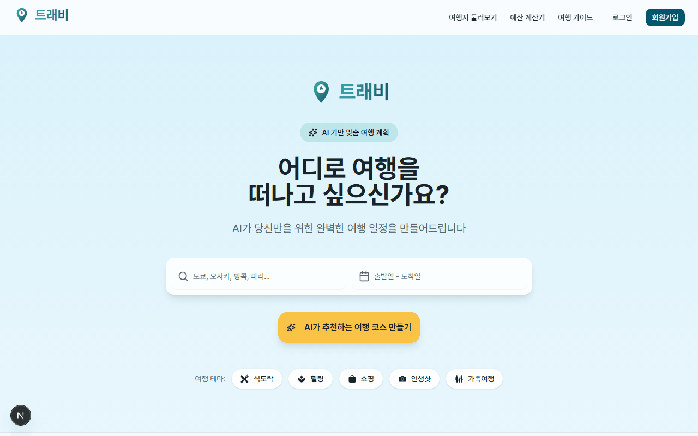
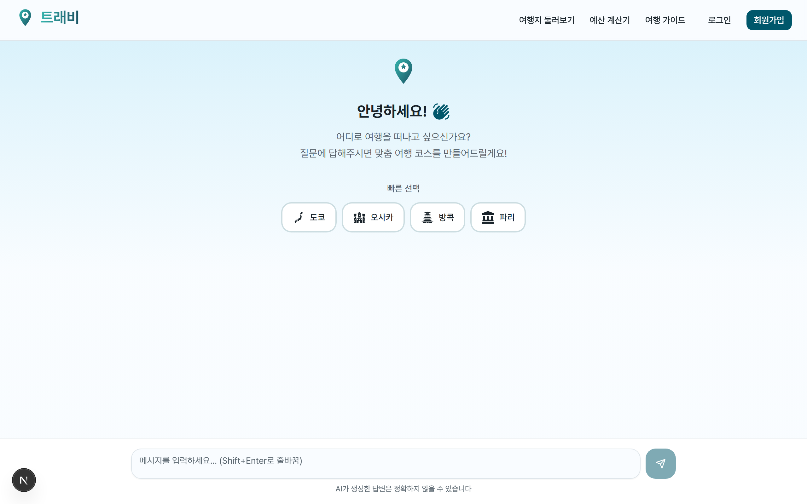
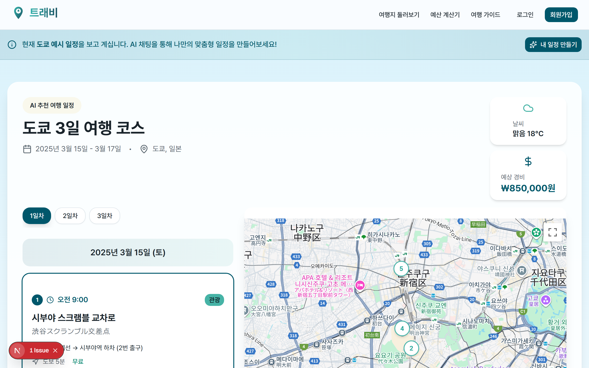
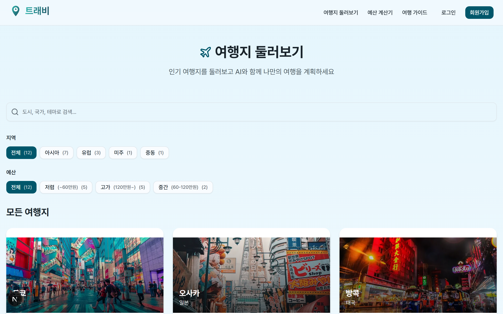
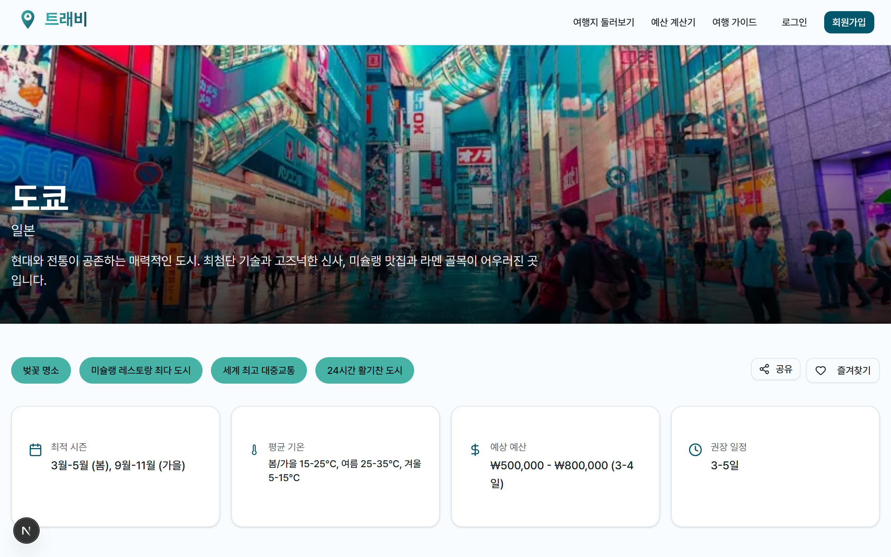
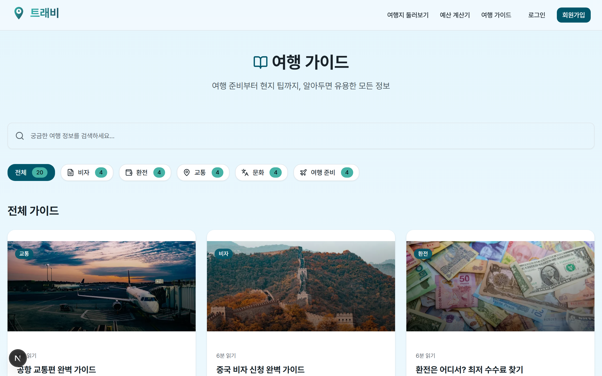

  
  
  
  

<h1 align="center">🗺️ 트래비 (Travi)</h1>

  <strong>AI 기반 여행 플래너</strong> - 대화로 쉽게 여행 계획을 세우세요

  <a href="#-주요-기능">주요 기능</a> •
  <a href="#-스크린샷">스크린샷</a> •
  <a href="#-기술-스택">기술 스택</a> •
  <a href="#-시작하기">시작하기</a>

---

## 📖 프로젝트 소개

여행 계획을 세우는 건 설레지만, 동시에 번거로운 일이기도 합니다.  
여행지 검색, 일정 짜기, 동선 최적화, 예산 관리까지...  

**트래비**는 AI와 자연스러운 대화를 통해 맞춤형 여행 일정을 생성하고,  
지도에서 바로 확인할 수 있는 서비스입니다.

> 💬 "3박 4일 도쿄 여행 일정 만들어줘" 한마디로 완벽한 여행 계획 완성!

**📅 개발 기간**: 2025.11.07 ~ 2025.12.01

---

## ✨ 주요 기능

| 기능 | 설명 |
|------|------|
| 🤖 **AI 챗봇** | GPT-4o-mini 기반 대화형 여행 일정 생성 |
| 🗺️ **구글 맵 연동** | 여행지 위치를 지도에 시각화 |
| 📅 **일정 관리** | 여행 계획 저장, 수정, 삭제 |
| 💰 **예산 계산기** | 여행 경비 관리 및 환율 계산 |
| 🌤️ **날씨 정보** | 여행지 실시간 날씨 확인 |
| 📚 **여행 가이드** | 20+ 여행 팁 & 가이드 콘텐츠 |
| 🏙️ **도시 탐색** | 인기 여행지 정보 제공 |
| ⭐ **즐겨찾기** | 가이드 & 도시 저장 |
| 🔗 **공유하기** | 여행 계획 링크 공유 |
| 📄 **PDF 다운로드** | 일정표 PDF 저장 |

---

## 🎬 데모

  

---

## 📸 스크린샷

### 🏠 메인 페이지

  

### 💬 AI 채팅

  

### 🗺️ 여행 결과

  

### 🏙️ 도시 탐색

  

### 📍 도시 상세

  

### 📚 여행 가이드

  

---

## 🛠️ 기술 스택

### Frontend

### Backend & Database

### AI & APIs

### 라이브러리

| 분류 | 기술 |
|------|------|
| **UI Components** | Radix UI, Lucide Icons |
| **State Management** | TanStack Query |
| **MDX** | next-mdx-remote |
| **PDF** | jspdf, html2canvas |
| **Monitoring** | Sentry, Vercel Analytics |

---

